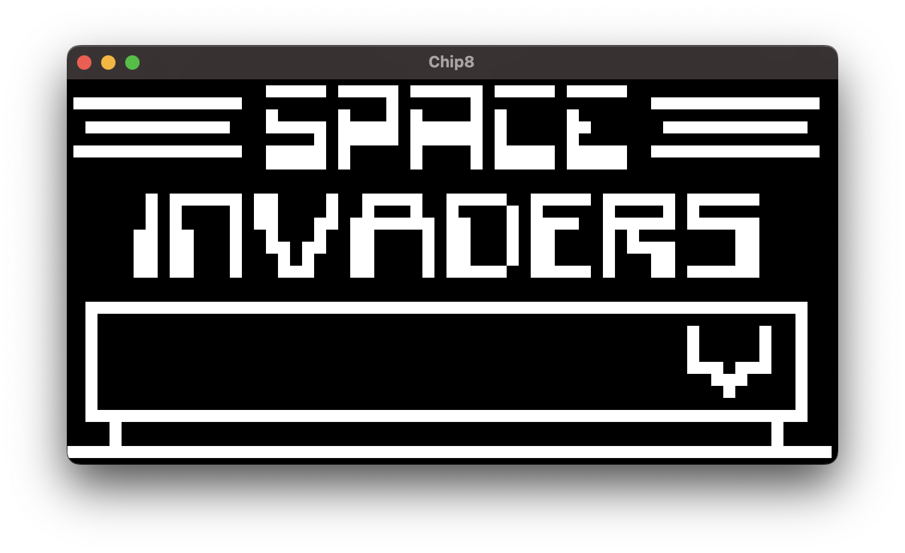

# rusty-chip8

A Chip8 emulator/interpreter crate in Rust.

This crate implements Chip8 logic and allows users to construct new Chip8 apps with their choice of graphics/audio libraries.



## Example

There is an example implementation using `bevy` in the `examples` directory.

## Run Example

```bash
cargo run --example rusty-chip8-bevy --release resources/roms/Space\ Invaders\ \[David\ Winter\].ch8
```
