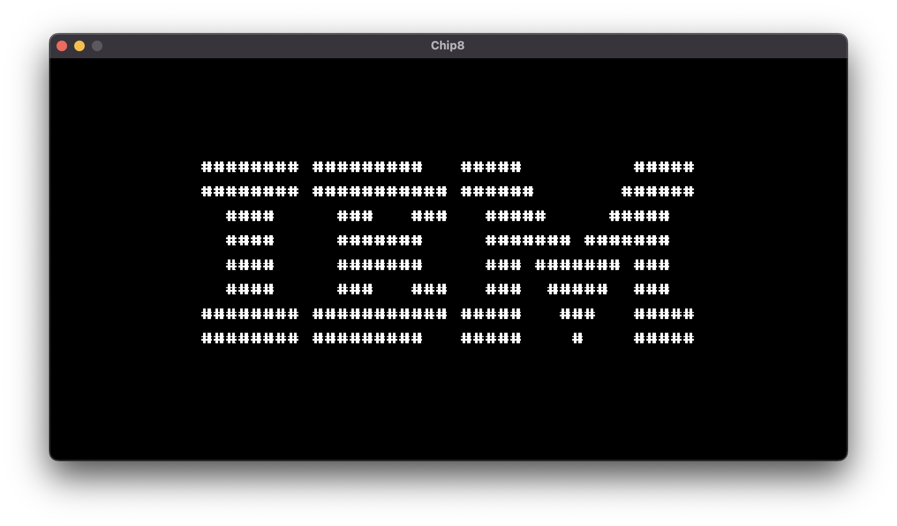

# rusty-chip8

A simple chip8 emulator/interpreter in Rust.



Current version supports only the [IBM Logo rom](resources/roms/IBM%20Logo.ch8).

## Install

```bash
cargo install rusty-chip8
```

## Build & Run

```bash
cargo run --release -- resources/roms/IBM\ Logo.ch8
```

## Usage

```bash
rusty-chip8 resources/roms/IBM\ Logo.ch8
```
